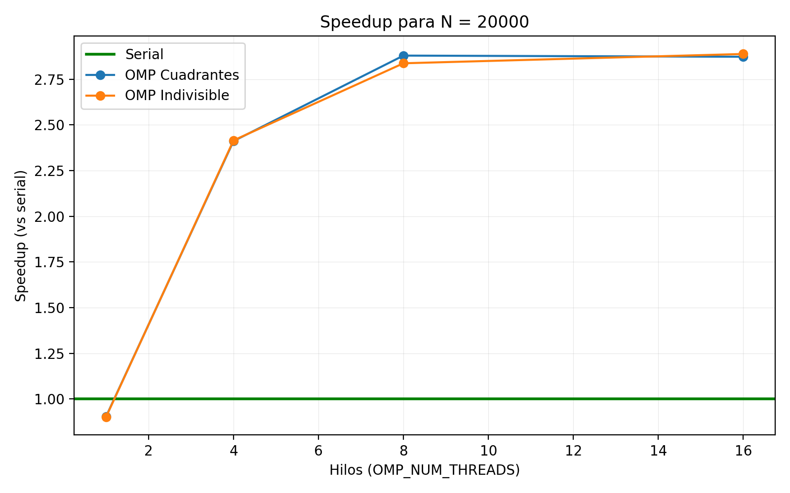
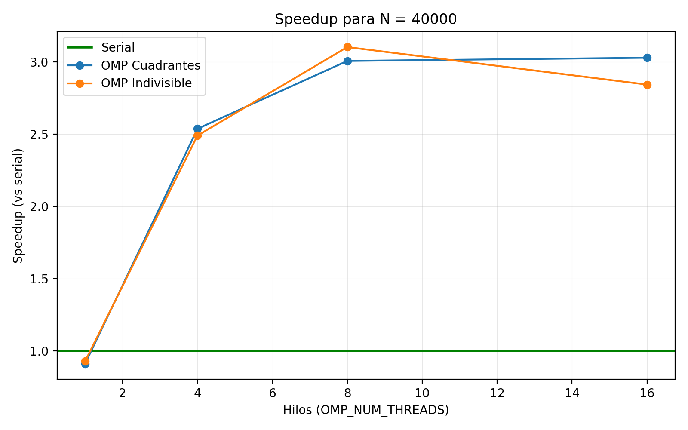
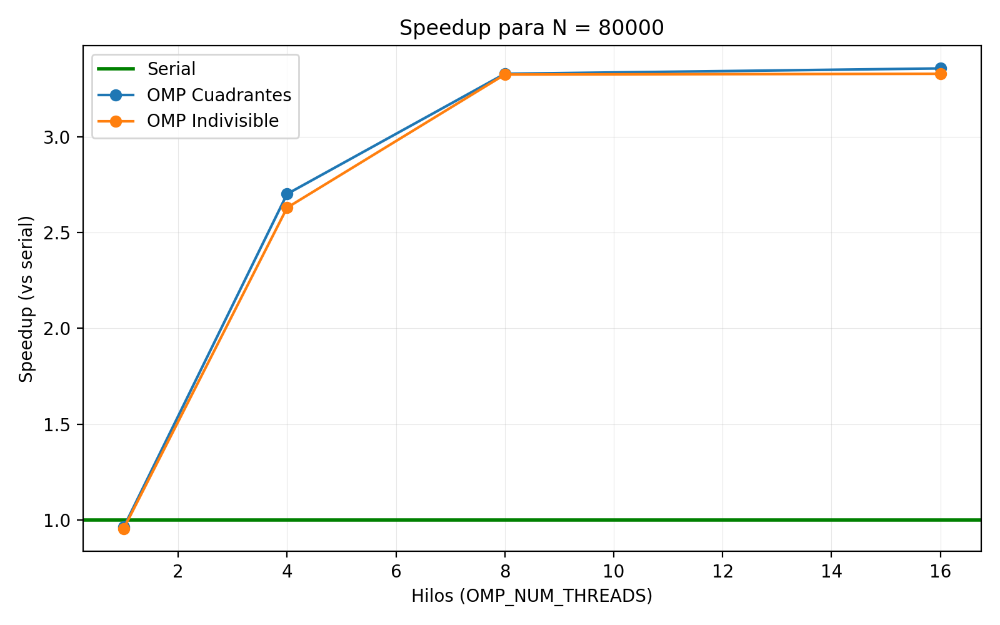
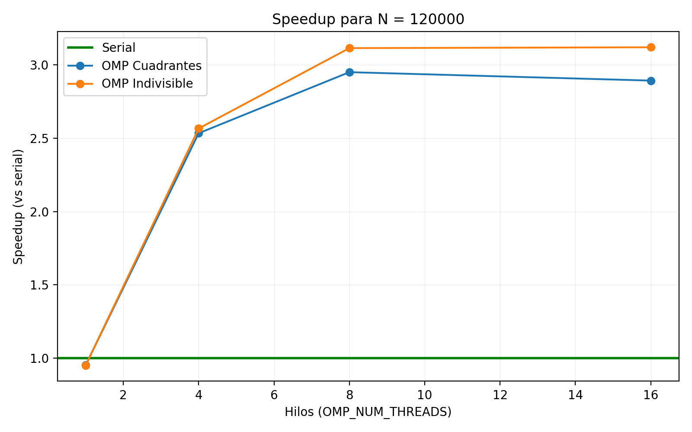
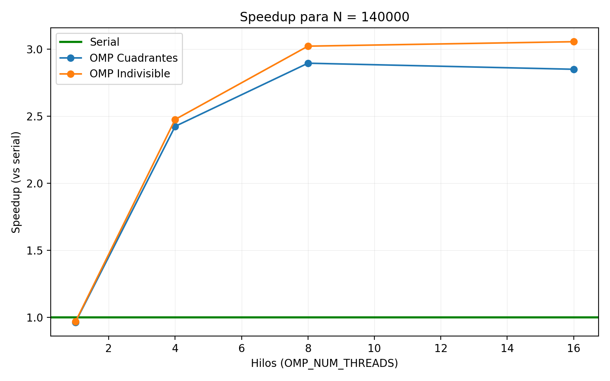
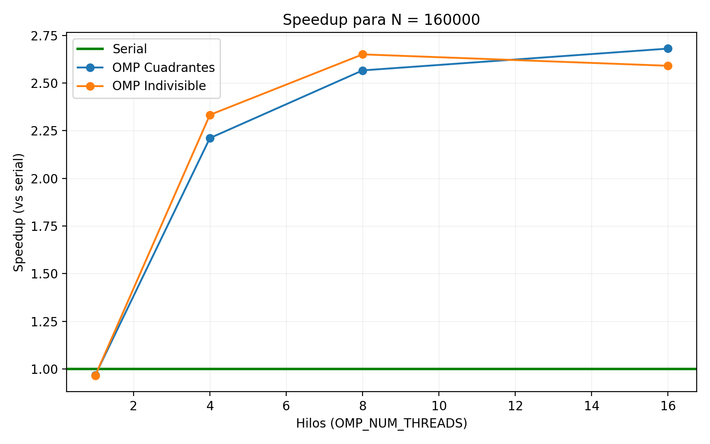
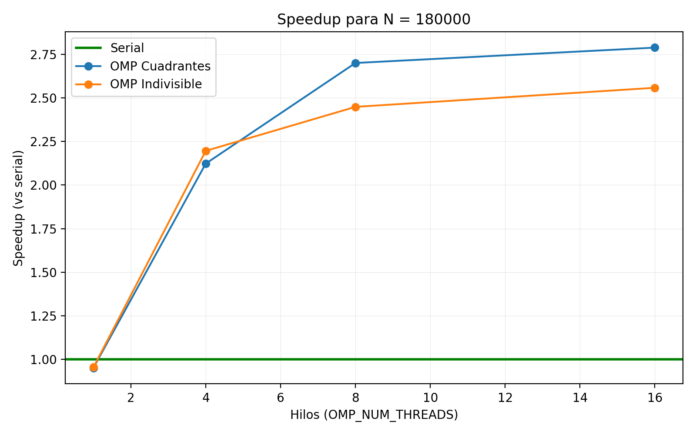
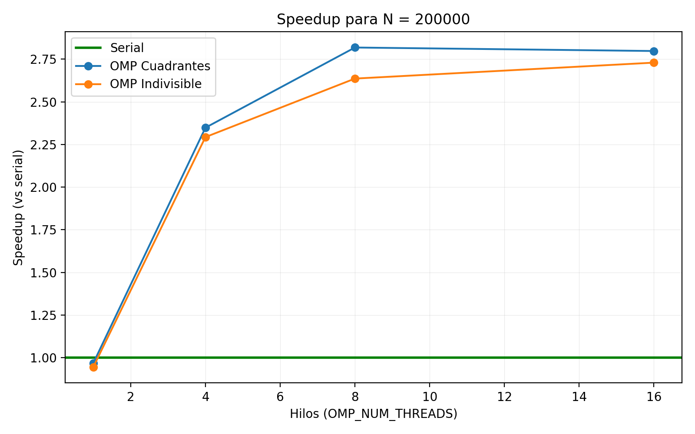
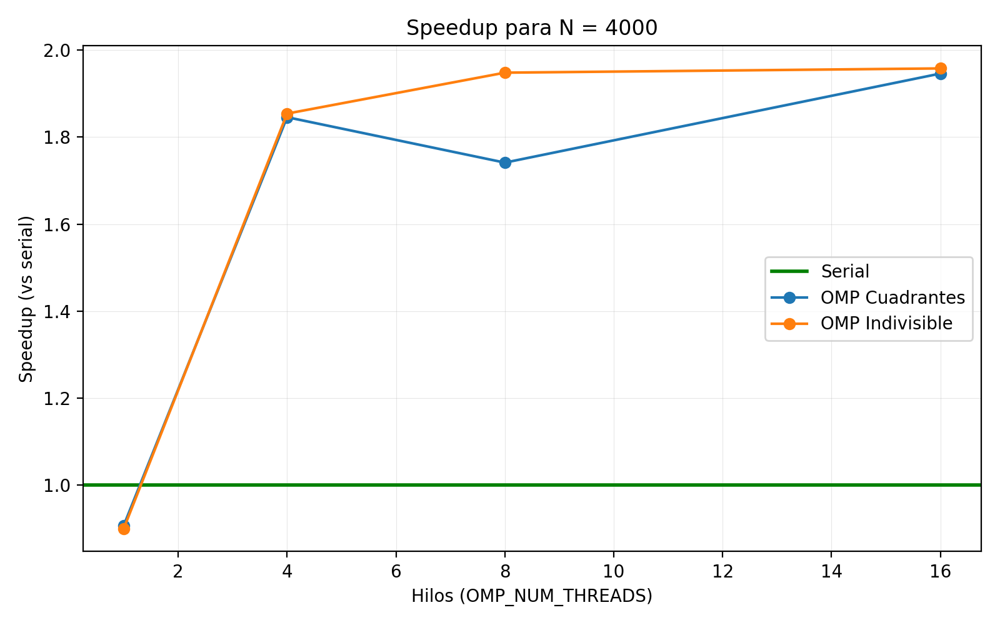

# Evaluación experimental

Este documento describe el diseño del experimento, el entorno HW/SW, el procedimiento de medición y un análisis de resultados para las tres variantes: serial, OMP indivisible y OMP cuadrantes.

## Definición del experimento

- Objetivo: medir speedup de dos versiones OpenMP contra la línea base serial para distintos tamaños `N` y conteos de hilos.
- Conjuntos de puntos: `N ∈ {20000, 40000, 80000, 120000, 140000, 160000, 180000, 200000}`.
- Hilos: `{1, V/2, V, 2V}`, con `V = hw.logicalcpu` (en Apple Silicon, `V` coincide con núcleos lógicos, sin SMT).
- Repeticiones: 10 corridas por combinación `(modo, N, hilos)` y promedio de tiempos.
- Entrada: `data/input/{N}_data.csv` generados con `scripts/DBSCAN_noise.ipynb` (o `scripts/run_all.sh`).
- Salida: `data/output/{N}_results.csv` con columnas `idx,x,y,label` (ruido = `-2`).
- Métrica: tiempo total medido alrededor de la ejecución del binario (incluye E/S). Los tiempos se registran en `results/times.csv` y se agregan en `results/speedup_summary.csv`.

Parámetros del algoritmo (fijos durante el experimento):
- Distancia euclidiana al cuadrado: comparación `d² <= eps²` en las tres variantes.
- Expansión de clúster: BFS secuencial (para evitar carreras); es común a todas las variantes.
- `epsilon` y `minPts`: usar los valores por defecto de los binarios o documentar si se cambian (recomendado: anotar en este documento los valores utilizados).

## Entorno HW/SW (ejecuciones reportadas)

- Equipo: MacBook Air M2 (Apple Silicon)
  - CPU: Apple M2, 8 núcleos (4 de performance + 4 de eficiencia), sin SMT.
  - Memoria: 16 GB RAM unificada.
  - Almacenamiento: 512 GB NVMe.
  - SO: macOS 15.7.
- Toolchain:
  - CMake ≥ 3.16 (modo Release, `-O3`).
  - Compilador: AppleClang (con `libomp` de Homebrew para OpenMP).
  - OpenMP: runtime `libomp` (Homebrew); `OMP_NUM_THREADS` controlado por los scripts.
- Python: `numpy`, `pandas`, `matplotlib` para generación de datos y gráficas.

## Procedimiento

Opción A — Todo en uno (recomendado para reproducir):

```
bash scripts/run_all.sh
# o con tamaños específicos
bash scripts/run_all.sh 20000 40000 80000 120000
```

Esto ejecuta automáticamente: generación de datasets (data/input/{N}_data.csv), compilación (Release), benchmark (10 repeticiones; guarda `results/times.csv`) y gráficas de speedup en `results/plots/`, además de `results/speedup_summary.csv`.

Opción B — Paso a paso:

1) Generar datasets: abre `scripts/DBSCAN_noise.ipynb` y ejecuta la celda inicial (crea `data/input/{N}_data.csv`).
2) Compilar: `cmake -S . -B build -DCMAKE_BUILD_TYPE=Release && cmake --build build -j`.
3) Benchmark: `bash scripts/run_bench.sh` (10 repeticiones por combinación). Tiempos en `results/times.csv`.
4) Speedup: `python3 scripts/plot_speedup.py` produce `results/plots/speedup_N*.png` y `results/speedup_summary.csv`.
5) Validación visual de etiquetas: `python3 scripts/plot_results.py data/input/{N}_data.csv` (grafica `data/output/{N}_results.csv`).

Notas de medición:
- El tiempo medido incluye E/S (lectura de CSV y escritura de resultados). Para mediciones de cómputo puro, instrumentar dentro del binario.
- Se descarta un warm-up explícito; la repetición 1 puede ser más lenta por arranque de runtime/FS cache.

### CSV personalizado (opcional)

Si necesitas procesar un único CSV externo que no sigue el patrón `{N}_data.csv`, puedes usar el flujo rápido:

```
bash scripts/run_custom.sh data/input/extra/custom.csv
# o sin argumentos (toma el CSV más reciente en data/input/extra)
bash scripts/run_custom.sh
```

Esto compila en Release (si hace falta), ejecuta mediciones de `dbscan_serial`, `dbscan_omp_indivisible` y `dbscan_omp_cuadrantes` sobre ese CSV
para hilos {1, 2, 4, 8, 16}, y genera:
- `results/custom_times.csv` (crudo de esta corrida)
- `results/custom_speedup_summary.csv` (promedios y speedups)
- `results/plots/extra/speedup_N<...>.png` (único gráfico de speedup basado solo en ese CSV)

## Estrategias de paralelización (resumen)

- `dbscan_omp_indivisible`: paraleliza el bucle externo que precalcula `vecinosLista[i]` y `esCore[i]` con `#pragma omp parallel for schedule(dynamic)`. La búsqueda de vecinos de cada `i` es secuencial (evita paralelismo anidado y locks). La expansión BFS permanece secuencial.
- `dbscan_omp_cuadrantes`: mismo patrón con `schedule(static, ceil(N/4))` (4 bloques contiguos → “cuadrantes” lógicos). También mantiene BFS secuencial.

Consecuencia: ambas variantes reparten el coste dominante O(N²) de búsqueda de vecinos; la diferencia práctica proviene del reparto de iteraciones (dynamic vs bloques estáticos) y la localidad de memoria.

## Resultados y análisis

Resumen cuantitativo (rellenar con los promedios de `results/speedup_summary.csv`):
- Para cada `N`, comparar speedup vs hilos para `omp_indivisible` y `omp_cuadrantes`.
- Señalar el máximo speedup observado y el punto de saturación.

Interpretación esperada en M2 (8 hilos lógicos, sin SMT):
- Para `N` pequeños (≤ 40k), el overhead de paralelización compite con el cómputo; el speedup puede ser modesto o menor que 2×.
- Para `N` medianos/grandes (≥ 120k), la parte O(N²) domina y se observa mejor escalamiento, acercándose a 4–6× con 8 hilos, limitado por memoria/latencia.
- `2V` (16 hilos) implica sobre-suscripción en Apple Silicon (no hay SMT); es común ver estancamiento o degradación vs `V`.

Comparativa entre variantes:
- `omp_indivisible` vs `omp_cuadrantes`: comparten el mismo esquema (pre-cálculo paralelo + BFS secuencial), pero difieren en scheduling: `dynamic` (balance) vs `static` por bloques (localidad). Las diferencias suelen ser pequeñas y dependen del patrón de datos y del número de hilos.
- Conclusión típica: ninguna es consistentemente superior; `indivisible` es robusta cuando el trabajo por `i` varía, mientras que `cuadrantes` puede favorecer la caché al trabajar por bloques grandes.

Limitaciones y mejoras:
- BFS secuencial limita el speedup total; un rediseño (fusión de clústeres con DSU/union-find o “expand frontiers” paralelo) podría mejorar, con cuidado de las dependencias.
- Indexación espacial (rejilla/celdas ~ `eps`) podría reducir la complejidad efectiva por consulta, mejorando tanto serial como OMP.

### Figuras de speedup (comparación visual)

A continuación se incluyen las gráficas generadas a partir de `results/times.csv`. La línea verde horizontal representa la referencia serial (speedup = 1.0); las curvas muestran el speedup observado para las variantes OpenMP según el número de hilos.

- N = 20,000
  
  

- N = 40,000
  
  

- N = 80,000
  
  

- N = 120,000
  
  

- N = 140,000
  
  

- N = 160,000
  
  

- N = 180,000
  
  

- N = 200,000
  
  

- N = 4,000 (prueba pequeña)
  
  

Observación rápida:
- Para `N` pequeños, las curvas OMP se mantienen cercanas a la línea verde por el overhead. A medida que `N` crece, el speedup mejora y se estabiliza cerca del límite impuesto por el paralelismo disponible y la memoria.

### Conclusiones basadas en `results/speedup_summary.csv`

- Mejor speedup global observado: ≈ 3.356× con `omp_cuadrantes` en `N=80,000` y `threads=16`. Para `omp_indivisible`, el mejor fue ≈ 3.328× también en `N=80,000` y `threads=16`.
- Tendencia por tamaño:
  - `N=4,000`: ambos OMP ≈ 1.95× (16 hilos). Overhead domina; el paralelismo ayuda poco.
  - `N=20,000`: ≈ 2.88× (`indivisible` con 16 hilos; `cuadrantes` ≈ 2.88× con 8 hilos).
  - `N=40,000`: `indivisible` ≈ 3.10× (8 hilos) vs `cuadrantes` ≈ 3.03× (16 hilos).
  - `N=80,000`: pico global (≈ 3.33–3.36×) en ambas variantes (16 hilos).
  - `N=120,000–200,000`: los speedups se sitúan en ≈ 2.6–3.1×. En `120k–140k` `indivisible` lidera ligeramente (≈ 3.12–3.06×), mientras que en `160k–200k` las diferencias oscilan y ambas rondan ≈ 2.6–2.9×.
- Hilos y sobre-suscripción:
  - La máquina (M2) tiene 8 hilos lógicos. Correr con 16 hilos sobre-suscribe; se observan ganancias puntuales o estables, pero no escalamiento lineal. En varios tamaños, 8 hilos ya da el mejor o casi mejor resultado (p. ej. `120k` en `cuadrantes`).
- Comparativa entre variantes:
  - No hay dominancia clara: `cuadrantes` obtiene el mejor caso absoluto (80k), `indivisible` lidera en `120k–140k`. Las diferencias suelen ser < 5–10%.
  - Dado que ambas comparten el mismo esquema (pre-cálculo paralelo + BFS secuencial), las pequeñas diferencias se explican por localidad de caché y reparto de iteraciones.
  - Límite principal: BFS secuencial y O(N²) en la búsqueda de vecinos; mejoras futuras deberían atacar esas dos partes.
  - Observación con 8 hilos: en `120k` y `140k` lidera `omp_indivisible`, mientras que a partir de `~160k` cambia la tendencia y en `180k–200k` suele liderar `omp_cuadrantes`.

## Material para la entrega

- Código fuente: `src/dbscan_serial.cpp`, `src/dbscan_omp_indivisible.cpp`, `src/dbscan_omp_cuadrantes.cpp`.
- Datos de experimento: `results/times.csv`, `results/speedup_summary.csv`.
- Figuras: `results/plots/speedup_N*.png` y, opcionalmente, `data/output/{N}_results.png`.
- Parámetros usados (`epsilon`, `minPts`) y entorno HW/SW (sección anterior).
- Comentarios de interpretación (esta sección) y uso responsable de IA (ver `docs/uso_ia.md`).
